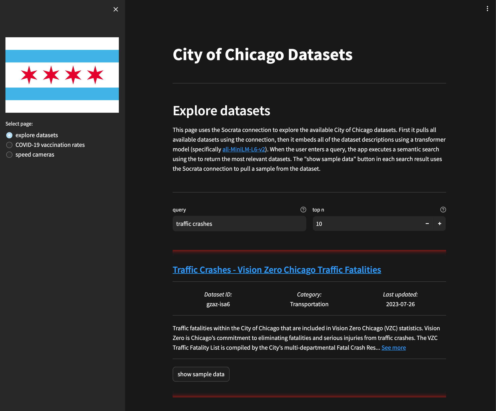

# Streamlit Connections Hackathon — Socrata connection

This repository contains a submission to the [Streamlit Connections Hackathon](https://discuss.streamlit.io/t/connections-hackathon/47574).
The app uses a [Socrata](https://dev.socrata.com) connection to connect to the City of Chicago Data Portal.
The connection leverages the [sodapy](https://github.com/xmunoz/sodapy) Python API.

The app allows the user to explore available datasets and demonstrates some example visualizations.

